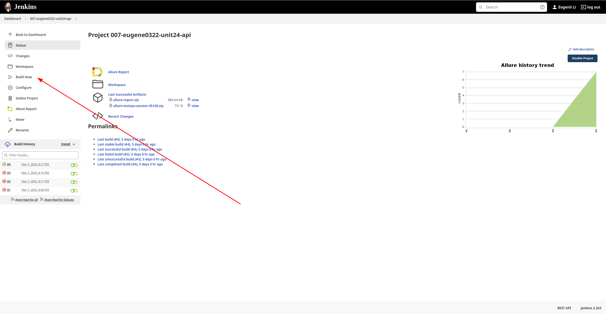
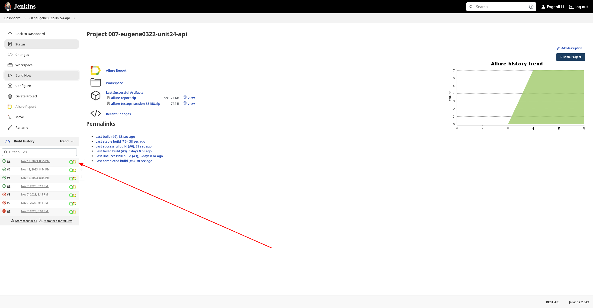
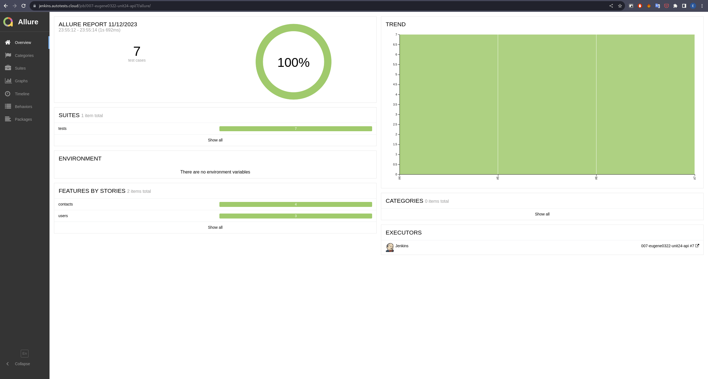
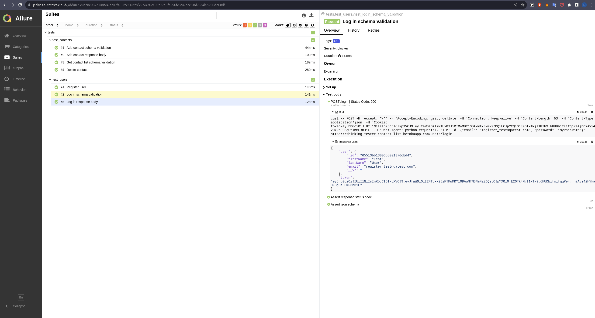
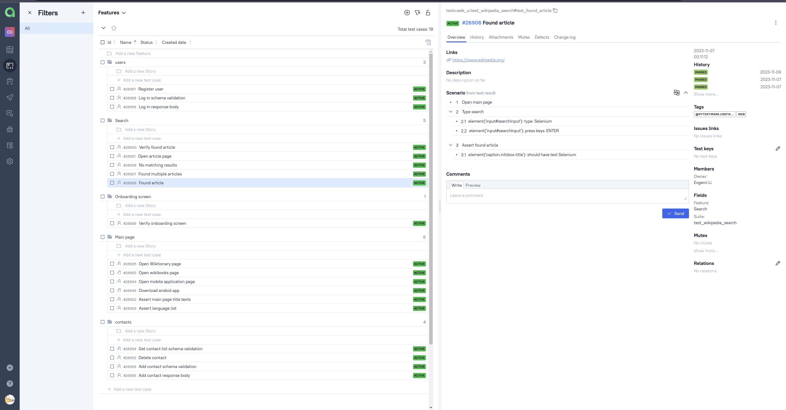
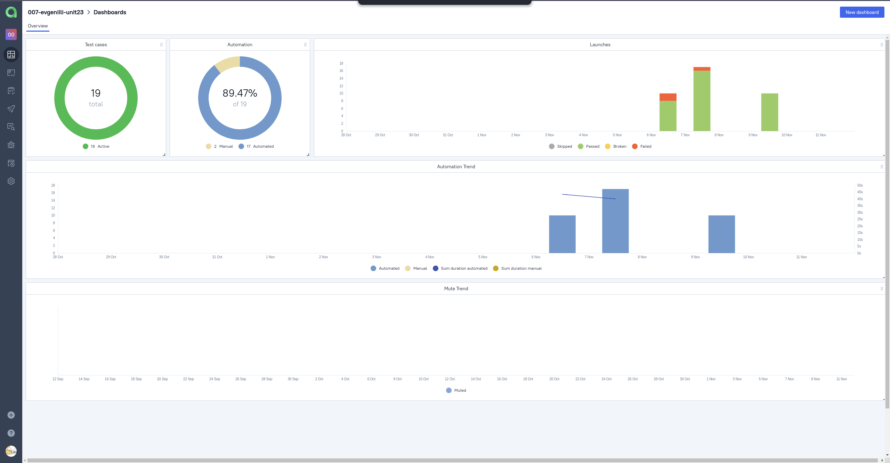
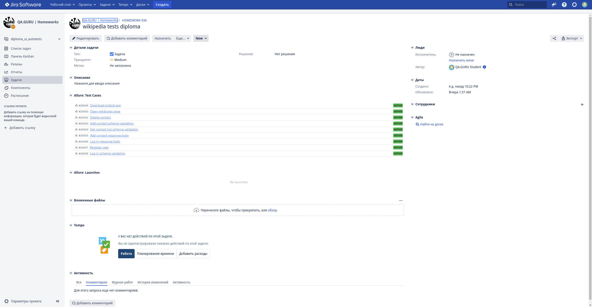
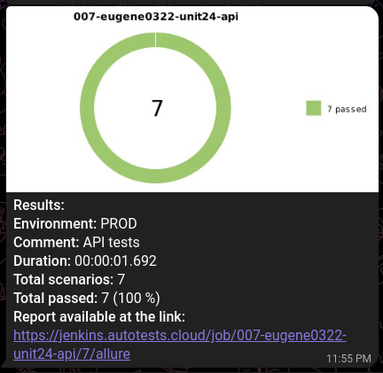

# Проект по тестированию API сайта "https://thinking-tester-contact-list.herokuapp.com/"
> <a target="_blank" href="https://thinking-tester-contact-list.herokuapp.com/">Ссылка на cайт</a>

## Список проверок
### <a href='https://github.com/evgeniili0322/contact-list-api-tests/blob/master/tests/test_users.py'>/users</a>
 - Проверка регистрации пользователя;
 - Проверка схемы ответа авторизаци;
 - Проверка тела ответа авторизации

### <a href='https://github.com/evgeniili0322/contact-list-api-tests/blob/master/tests/test_contacts.py'>/contacts</a>
 - Проверка схемы ответа создания контакта;
 - Проверка тела ответа создания контакта;
 - Проверка схемы ответа получения списка контактов;
 - Проверка тела ответа удаления контакта.

## Технoлoгии и инструмeнты
<p align="center">
<a href="https://www.python.org/"></a>
<a href="https://docs.pytest.org/"></a>
<a href="https://www.jenkins.io/"></a>
<a href="https://qameta.io/allure-report/"></a>
<a href="https://qameta.io/allure-report/"></a>
<a href="https://www.atlassian.com/software/jira"></a>
<a href="https://github.com/"></a>
<a href="https://web.telegram.org/"></a>
</p>

# Запуск автотестов в Jenkins
#### 1. Открыть <a target="_blank" href="https://jenkins.autotests.cloud/job/007-eugene0322-unit24-api/">проект</a>
#### 2. Выбрать пункт "**Build Now**"

#### 3. Результат запуска сборки можно посмотреть в отчёте Allure


## Запуск автотестов локально
### Создание виртуального окружения и установка зависимостей:
```bash
python -m venv venv
source venv/bin/activate
pip install -r requirements.txt
```
### Запуск:

```bash
pytest tests
```
### Получение отчёта:
```bash
allure serve
```

## Allure Отчет
##### После прохождения тестов, результаты можно посмотреть в генерируемом Allure отчете.


##### Во вкладке Graphs можно посмотреть графики о прохождении тестов, по их приоритезации, по времени прохождения и др.


##### Во вкладке Suites находятся собранные тест кейсы, у которых описаны шаги и добавлено тело ответа и curl запрос.


# Интеграция с Allure TestOps и Jira
#### Результаты прохождения тестов, а также сами тест-кейсы будут отправлены в Allure TestOps

#### Также на основе результатов прохождения тестов будет сгенерирован дашборд

#### Все тест кейсы также могут быть прикреплены к задаче в Jira Software


# Настроено автоматическое оповещение о результатах сборки Jenkins в Telegram

